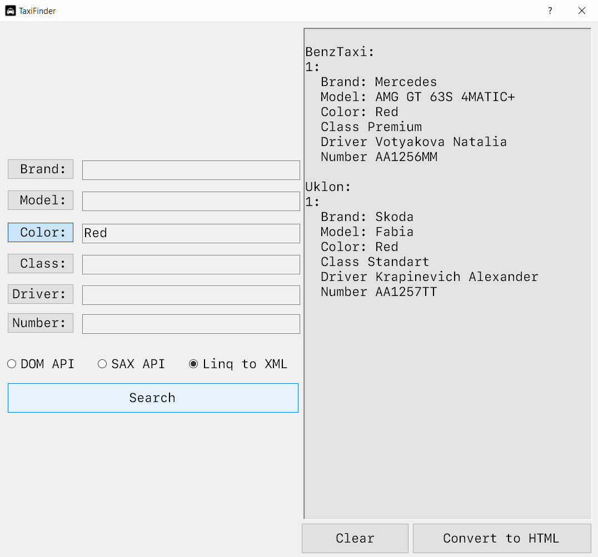
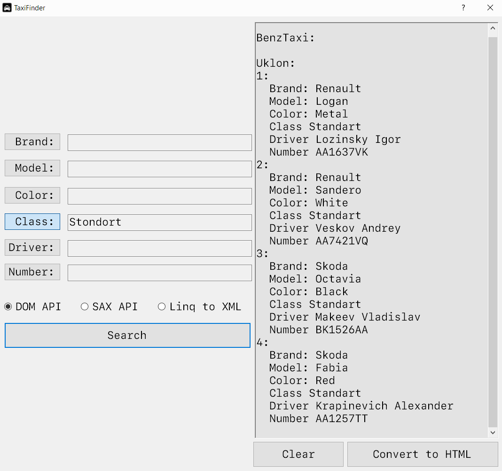
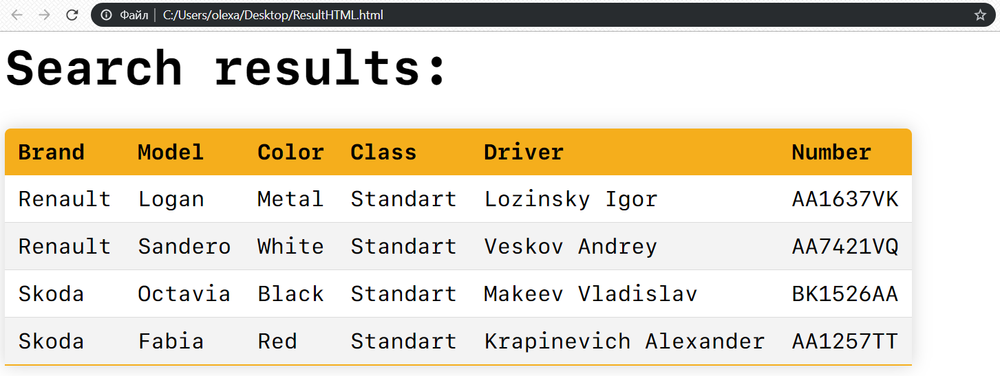

# TaxiFinder
# OOP Laboratory Work 3. Dynamic search system in custom XML data bases.

Application for finding appropriate taxi cars through filters in provided XML files.
Search can be executed in 3 different ways: DOM API, SAX API and Linq to XML.
I used the Levenshtein Distance Algorithm, so every input is evaluated in probability terms.
It allows the user to make mistakes in words, but if the similarity is >= 50% algorithm will generate a search request.
Also, you can convert search results into a fancy HTML file.

Screenshots:

